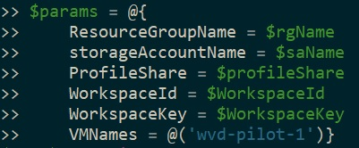
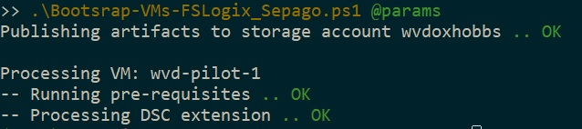

# Azure WVD Bootstrap Script and DSC Resource Module

## Description

This script and DSC resource module will hopefully ease some pains when needing to install and configure FSLogix and/or Sepago on Azure WVD session hosts.

## Script

The script to kick off the bootstrap process for only FSLogix is in the root of the repo, `Bootstrap-VMs-FSLogix.ps1`.
There is also a script available to kickoff the bootstrap process of both FSLogix and Sepago, `Bootstrap-VMs-FSLogix_Sepago.ps1`.

However, the DSC resource is published to the PowerShell Gallery [here](https://www.powershellgallery.com/packages/AzureWvdDsc/0.2.0) and can be used independent of this repository.

This `Bootstrap-VMs-FSLogix` script can take four optional parameters:

* `ResourceGroupName`:The resource group in which the storage account and session hosts reside
* `StorageAccountName`: The name of the storage account where the DSC artifacts will be staged
* `StorageAccountResourceGroupName`: Optional - Specify the resource group in which the storage account for the DSC artifact resides.  If omitted, the `ResourceGroupName` parameter will be used for both VM resources and the storage account.
* `ProfileShare`: The UNC Path where your FSLogix profile VHDs will be stored
* `VMNames`: Provide a list of VMs that need to be configured.  If this value is ommitted then the script will    dynamically pull a list of VMs from the provided resource group

The `Bootstrap-VMs-FSLogix_Sepago` script takes the same parameters above and adds the following:

* `WorkspaceId`: The ID of the Log Analytics workspace to which the sepago agent will send data.
* `WorkspaceKey`: The key used to obtain access to the Log Analytics workspace.

## Examples

```
.\Bootstrap-VMs-FSLogix.ps1 -ResourceGroupName 'wvd-lab' -StorageAccountName 'wvdlabdalsjf' -ProfileShare \\myUnc\Share -VMNames 'wvd-personal-1', 'wvd-personal-2' -Verbose
```

```
.\Bootstrap-VMs-FSLogix.ps1 -ResourceGroupName 'wvd-lab' -StorageAccountName 'wvdlabdljf' -ProfileShare \\myUnc\Share -Verbose
```

Screen capture example of `Bootstrap-VMs-FSLogix_Sepago`





## DSC Resource Module - AzureWvdDsc

The `AzureWvdDsc` module contains two DSC resources:

* `FSLogixInstall` - Installs FSLogix (x64)
* `ConfigureFSLogix` - Configures the necessary registry settings for FSLogix to use a file share for user profile VHDs
* `SepagoAgentInstall` - Installs the log analytics agent for sepago
* `SepagoAgentConfig` - Configured the sepago agent configuration file and scheduled task

## ChangeLog

v0.4.0
* Added the capability to use a storage account in a different resource group than the VM resources to the Bootstrap scripts.

v0.3.1
* Fixed incorrectly spelled script name

v0.3.0
* Added `SepagoAgentConfig` and `SepagoAgentInstall` DSC resources
